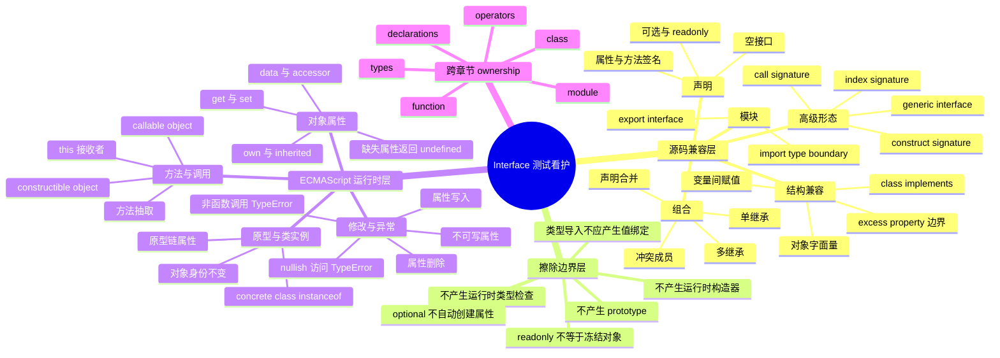

# Interface ECMA Runtime Test Mind Map and Design Points

## 1. Purpose

本文件为 `03_interface` 提供测试脑图和分层测试设计。核心前提是：ECMAScript 2022 没有 `interface` 声明；`interface` 的声明、继承、结构兼容和合并属于 TypeScript / ArkTS 源码兼容层。ECMA-262 只规范 interface 擦除后实际值的对象、属性、函数、类、原型和异常行为。

因此，测试结论必须区分：

| 层次 | 规范来源 | 主要验证方式 |
|---|---|---|
| 源码兼容层 | TypeScript 语义与 ArkTS Dynamic 实现 | parser / binder / checker 编译验证 |
| 擦除边界层 | ArkTS Dynamic 编译与运行实现 | 编译产物检查、运行 smoke |
| 运行时语义层 | ECMAScript 2022 | XTS / ohosTest 运行断言 |

## 2. Test Mind Map



## 3. Normative Reference Boundary

### 3.1 ECMAScript 2022 references

- [ECMAScript 2022, Object Type](https://262.ecma-international.org/13.0/#sec-object-type): 对象属性、数据属性、访问器属性和原型语义。
- [ECMAScript 2022, Object Initializer](https://262.ecma-international.org/13.0/#sec-object-initializer): interface 擦除后常见对象值的创建语义。
- [ECMAScript 2022, Property Accessors](https://262.ecma-international.org/13.0/#sec-property-accessors): 属性读取、计算属性访问和 nullish 基值异常。
- [ECMAScript 2022, Function Calls](https://262.ecma-international.org/13.0/#sec-function-calls): 方法调用、接收者和非可调用值异常。
- [ECMAScript 2022, Class Definitions](https://262.ecma-international.org/13.0/#sec-class-definitions): concrete class 与实例的运行时语义。
- [ECMAScript 2022, Relational Operators](https://262.ecma-international.org/13.0/#sec-relational-operators): `instanceof` 与原型链判断。

### 3.2 Compatibility references

- [TypeScript Object Types](https://www.typescriptlang.org/docs/handbook/2/objects.html): 属性、可选属性、readonly、extends 与结构兼容。
- [TypeScript Declaration Merging](https://www.typescriptlang.org/docs/handbook/declaration-merging.html): interface 同名声明合并及冲突规则。
- [TypeScript Modules Reference](https://www.typescriptlang.org/docs/handbook/modules/reference): 类型声明的导入、导出与运行时发射边界。

TypeScript 文档只作为兼容性参照。ArkTS Dynamic 是否接受对应语法、在哪个阶段诊断，必须通过官方工具链确认，不能直接从 TypeScript 行为推定。

## 4. Test Design Principles

1. 一个用例只验证一个核心语义；源码检查与运行时检查分开。
2. `pass` 必须包含真实运行断言；纯语法接受性优先归 compiler smoke。
3. 未确认的 ArkTS Dynamic 语法放入 `boundary`，不得提前标为 pass 或 fail_compile。
4. `fail_compile` 只保留一个主要诊断点，并记录预期阶段为 parse、bind 或 check。
5. 运行时用例只对实际对象、函数或 class 实例断言，不把 interface 当作 ECMAScript 值。
6. interface 擦除不等于对象被冻结、自动补字段或自动执行结构校验。
7. 与 `types`、`function`、`class`、`module`、`operators` 的交叉行为在本目录仅验证 interface 引入的差异。

## 5. Source Compatibility Design Points

下表复用现有 Coverage ID；“预期”表示待工具链确认的测试意图，不代表当前实现已验证。

| Coverage ID | 优先级 | 测试设计点 | 建议类型 | 预期阶段/结果 |
|---|---|---|---|---|
| IF-DECL-001 | P0 | 空 interface 声明可被类型位置引用 | pass | compile success |
| IF-DECL-002 | P0 | interface 同时包含属性与方法签名 | pass | compile success |
| IF-DECL-003 | P1 | interface 名称只用于类型位置 | boundary | check pending |
| IF-DECL-005 | P1 | block/function/module 中声明位置限制 | boundary | parse/bind pending |
| IF-PROP-001 | P0 | required property 类型和存在性满足 | pass | compile success |
| IF-PROP-002 | P0 | required property 缺失 | boundary/fail_compile | diagnostic pending |
| IF-PROP-003 | P0 | required property 类型不兼容 | boundary/fail_compile | diagnostic pending |
| IF-OPT-001 | P0 | optional property 可省略 | pass | compile success |
| IF-OPT-002 | P0 | optional property 存在时类型正确 | pass | compile success |
| IF-OPT-003 | P1 | optional property 直接使用的安全检查 | boundary | check pending |
| IF-RO-001 | P0 | readonly property 初始化后可读 | pass | runtime value |
| IF-RO-002 | P0 | readonly property 源码重新赋值 | boundary/fail_compile | diagnostic pending |
| IF-RO-003 | P1 | readonly 与 const binding 的约束边界 | boundary | check pending |
| IF-METHOD-001 | P0 | 方法签名由对象方法实现 | pass | runtime value |
| IF-METHOD-002 | P0 | 方法参数不兼容 | boundary/fail_compile | diagnostic pending |
| IF-METHOD-003 | P0 | 方法返回值不兼容 | boundary/fail_compile | diagnostic pending |
| IF-OPTMETHOD-001 | P1 | optional method 可省略 | pass | compile success |
| IF-OPTMETHOD-002 | P1 | optional method 存在并可调用 | pass | runtime value |
| IF-EXT-001 | P0 | 单 interface 继承合并成员 | pass | runtime value |
| IF-EXT-002 | P0 | 继承属性冲突 | boundary/fail_compile | diagnostic pending |
| IF-EXT-003 | P1 | 多层 interface 继承 | pass | runtime value |
| IF-EXT-004 | P1 | interface 直接或间接自继承 | boundary/fail_compile | diagnostic pending |
| IF-MULTEXT-001 | P0 | 多继承组合无冲突成员 | pass | runtime value |
| IF-MULTEXT-002 | P0 | 多继承同名兼容成员 | boundary | check pending |
| IF-MULTEXT-003 | P0 | 多继承同名冲突成员 | boundary/fail_compile | diagnostic pending |
| IF-STRUCT-001 | P0 | 对象变量按结构兼容赋值 | pass | runtime value |
| IF-STRUCT-002 | P0 | object literal 缺失 required property | boundary/fail_compile | diagnostic pending |
| IF-STRUCT-003 | P1 | object literal excess property 行为 | boundary | check pending |
| IF-STRUCT-004 | P1 | object literal 省略 optional property | pass | runtime value |
| IF-IMPL-001 | P0 | class 完整实现 interface | pass | runtime value |
| IF-IMPL-002 | P0 | class 缺少 required member | boundary/fail_compile | diagnostic pending |
| IF-IMPL-003 | P0 | class 方法签名不兼容 | boundary/fail_compile | diagnostic pending |
| IF-IMPL-004 | P1 | class 实现多个 interface | pass | runtime value |
| IF-IDX-001 | P1 | string index signature | boundary | check pending |
| IF-IDX-002 | P0 | number index signature | boundary | check pending |
| IF-CALL-001 | P1 | interface call signature 接受函数值 | boundary | check/runtime pending |
| IF-CTOR-001 | P1 | interface construct signature 接受构造函数值 | boundary | check/runtime pending |
| IF-MERGE-001 | P1 | 同名 interface 兼容成员合并 | boundary | bind/check pending |
| IF-MERGE-003 | P1 | 同名 interface 冲突成员 | boundary/fail_compile | diagnostic pending |
| IF-GEN-001 | P1 | generic interface 基础实例化 | boundary | check pending |
| IF-MOD-001 | P1 | export interface 语法 | boundary | compile pending |
| IF-MOD-002 | P0 | import interface/type-only binding | boundary | compile/link pending |

## 6. ECMA Runtime Design Points

这些测试不验证 interface 语法本身，而验证带 interface 类型信息的值在运行时仍遵循 ECMAScript 对象模型。

| Design Key | 关联 Coverage ID | 优先级 | 测试设计点 | 关键断言 |
|---|---|---|---|---|
| RT-OBJ-01 | IF-RT-001 | P0 | interface 注解不改变对象身份 | 注解前后严格相等 |
| RT-OBJ-02 | IF-RT-001 | P0 | object literal 属性值保持 | required property 返回原值 |
| RT-OBJ-03 | IF-PROP-005 | P1 | 缺失的普通属性遵循 ECMA `[[Get]]` | 结果为 `undefined`，不自动补值 |
| RT-OBJ-04 | IF-OPT-004 | P0 | optional property 省略后的运行时形态 | 不产生隐式 own property |
| RT-OBJ-05 | IF-OPT-005 | P1 | optional property 后续动态加入 | 加入后可读取，身份不变 |
| RT-OBJ-06 | IF-RO-004 | P1 | readonly 不自动冻结运行时对象 | 只记录实现边界，不预设可写性 |
| RT-OBJ-07 | IF-RO-005 | P1 | readonly 与 ECMAScript `[[Writable]]` 独立 | descriptor 行为由实际对象决定 |
| RT-OBJ-08 | IF-RT-004 | P1 | interface 不改变 own/inherited property 查找 | 继承属性按原型链可读 |
| RT-OBJ-09 | IF-RT-004 | P1 | accessor getter 保留 receiver | getter 中 `this` 指向接收对象 |
| RT-OBJ-10 | IF-RT-004 | P1 | accessor setter 保留 receiver | setter 修改实际接收对象状态 |
| RT-CALL-01 | IF-METHOD-004 | P0 | 对象方法经属性引用调用 | 方法得到对象 receiver |
| RT-CALL-02 | IF-METHOD-004 | P1 | 方法抽取后调用 | 行为由普通函数 `this` 规则决定 |
| RT-CALL-03 | IF-CALL-002 | P1 | call-signature 值实际为 callable object | 调用返回预期值 |
| RT-CALL-04 | IF-CALL-003 | P1 | 非 callable 对象声称满足接口的边界 | 调用产生 TypeError 或编译诊断 |
| RT-CALL-05 | IF-CTOR-002 | P1 | construct-signature 值实际可构造 | `new` 返回对象 |
| RT-CALL-06 | IF-CTOR-003 | P1 | 非 constructor 值的构造调用 | TypeError 或编译诊断 |
| RT-PROTO-01 | IF-RT-005 | P0 | class implements 不改变 concrete prototype | 实例方法仍来自 class prototype |
| RT-PROTO-02 | IF-IMPL-005 | P0 | concrete class 实例的 `instanceof` | 对 concrete class 为 true |
| RT-PROTO-03 | IF-RT-003 | P0 | interface 不能直接作为运行时 `instanceof` RHS | fail_compile 或 boundary，待确认 |
| RT-PROTO-04 | IF-RT-002 | P0 | interface 名称的 `typeof` 边界 | 不把 interface 预设为运行时值 |
| RT-PROTO-05 | IF-RT-005 | P1 | interface extends 不改变对象原型链 | 原型链仅由实际构造过程决定 |
| RT-MUT-01 | IF-OPT-005 | P1 | optional property 删除 | 删除结果按实际 descriptor 决定 |
| RT-MUT-02 | IF-RO-005 | P1 | non-writable data property 写入 | strict-mode 行为按 ECMA 验证 |
| RT-ERR-01 | IF-OPTMETHOD-003 | P0 | 省略 optional method 后直接调用 | TypeError，或由源码检查提前拒绝 |
| RT-ERR-02 | IF-STRUCT-005 | P1 | 类型断言不执行运行时结构验证 | 不自动抛出“interface mismatch”异常 |
| RT-ERR-03 | IF-METHOD-005 | P1 | 属性存在但值不可调用 | 调用产生 TypeError |
| RT-ERR-04 | IF-OPT-003 | P1 | null/undefined 基值上的属性访问 | 按 ECMA 产生 TypeError |
| RT-MOD-01 | IF-MOD-003 | P1 | type-only interface 不形成运行时值导出 | module namespace 不应依赖 interface 值 |
| RT-MOD-02 | IF-MOD-004 | P1 | interface 导入不改变实际值导入语义 | concrete value binding 正常工作 |

## 7. Evaluation Patterns

### 7.1 Compile acceptance

```text
source
  -> parse/bind/check
  -> compile success or one focused diagnostic
```

适用于声明、extends、implements、structural compatibility、merging、index/call/construct signature。此类结果不是 ECMA-262 结论。

### 7.2 Runtime erasure

```text
interface-annotated source
  -> compile
  -> run concrete object/function/class value
  -> assert ECMA object behavior
```

适用于 `IF-RT-*`、`IF-PROP-005`、`IF-METHOD-004`、`IF-OPT-004/005`。

### 7.3 Negative runtime

运行时负向必须捕获异常并断言异常发生。优先验证错误种类；错误消息仅在官方工具链稳定后固定，避免脆弱断言。

### 7.4 Differential pair

对高风险边界建立成对用例：

| Pair | Interface 版本 | Runtime control |
|---|---|---|
| readonly | interface readonly property | 普通对象 writable/non-writable descriptor |
| optional method | optional method omitted | 普通对象缺失方法调用 |
| implements | class implements interface | 相同 class 去掉 implements |
| structural typing | interface-typed object | 相同 object literal 无类型注解 |
| module erasure | exported/imported interface | concrete value export/import |

两侧运行行为应由同一 ECMAScript 对象模型解释；差异应只来自源码接受性或编译产物。

## 8. Priority Plan

### P0: first verification batch

1. `IF-ARKTS-001/002`: 先确认当前 ArkTS Dynamic 的 interface 支持模式。
2. `IF-RT-001/002/003`: 确认擦除、`typeof`、`instanceof interface` 边界。
3. `IF-PROP-001/002/003`: required property 正负向。
4. `IF-OPT-001/002/004`: optional property 源码与运行时形态。
5. `IF-METHOD-001/002/003`: method signature 正负向。
6. `IF-EXT-001/002` 与 `IF-MULTEXT-001/003`: 继承与冲突。
7. `IF-IMPL-001/002/003`: class implements enforcement。
8. `IF-STRUCT-001/002`: 结构兼容与缺失成员。
9. `IF-MOD-002`: interface import 的编译与发射边界。

### P1: second verification batch

1. readonly、optional method、index/call/construct signature。
2. declaration merging、generic interface、多层继承。
3. getter/setter、原型链、方法 receiver、动态修改。
4. module namespace 与 concrete value import 对照。

## 9. Ownership Matrix

| 测试内容 | 主归属 | `03_interface` 中的处理方式 |
|---|---|---|
| interface 语法、extends、merging、structural compatibility | `03_interface` | 主覆盖 |
| object `[[Get]]` / `[[Set]]` / prototype | `00_the_basics/types` 或 operators | 仅做 interface 擦除集成 |
| method `this`、call/apply/bind | `01_function` / `07_this_keyword` | 仅做 interface method 集成 |
| class constructor、inheritance、field | `02_class` | 仅做 implements 集成 |
| import resolution、cycles、live binding | `06_module` | 仅做 interface type/value erasure边界 |
| `typeof`、`instanceof`、`in`、`delete` | operators/types | 仅做 interface 无运行时实体边界 |
| generic constraint/inference | `04_generic` | 仅做 generic interface 语法入口 |

## 10. Exit Criteria

本章节首轮验证完成需同时满足：

- P0 源码兼容点已由官方 ArkTS Dynamic 工具链确认；
- 每个 pass/regression 用例有真实断言；
- 每个 fail_compile 只有一个主要诊断点；
- interface 擦除结论有 concrete runtime control 对照；
- boundary 均保留明确原因和后续确认方式；
- `IF-RT-*` 不再把 interface 描述为 ECMAScript 运行时实体；
- coverage matrix、Case ID registry 和实际路径一致；
- 编译验证与运行验证结果分开记录。

